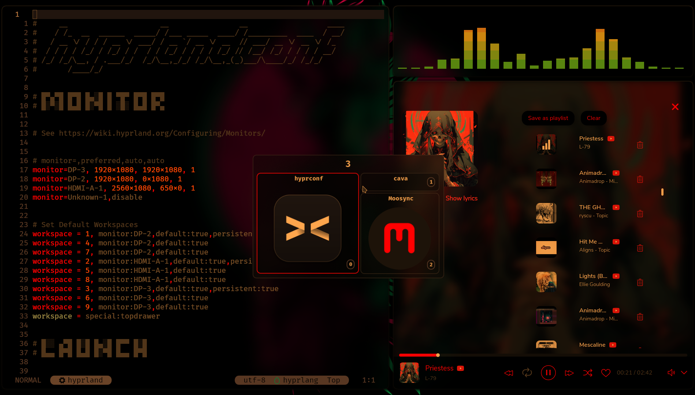

# sunsetr

    Automatic blue-light filter for Hyprland, Niri, and everything Wayland

    

  
  
  

  <a href="https://psi4j.github.io/sunsetr/installation.html">Installation</a> | <a href="https://psi4j.github.io/sunsetr/quick-start.html">Quick Start</a> | <a href="https://psi4j.github.io/sunsetr/configuration/">Configuration</a> | <a href="https://psi4j.github.io/sunsetr/commands/">Commands</a>

Sunsetr is an automatic blue-light filter for Wayland compositors. It automates smooth color-temperature transitions from neutral to warmer tones, designed to reduce eye strain and improve sleep. Sunsetr automatically adjusts your displays based on your geolocation or manual time settings. It can also be used to persist the same color-temperature and gamma indefinitely, and can alternate between various user-defined presets. The controller can integrate with and automate changes in your shell or UI applications via IPC.

## Features

- **Multi-Compositor Support**: Works with Hyprland, Niri, Sway, River, Wayfire, and other Wayland compositors
- **Native Hyprland CTM Backend**: Direct Color Transformation Matrix support for Hyprland
- **Smarter hyprsunset Management**: Add longer, cleaner, and more precise sunset/sunrise transitions to hyprsunset (Hyprland)
- **Smooth Transitions**: Configurable fade effects with adaptive algorithm
- **Preset Management**: Quick switching between configuration profiles (e.g., day, gaming, weekend)
- **Hot Reloading**: Live updates when config files change - no restart needed
- **IPC for Automation**: Unix socket-based IPC for scripting and external integrations
- **Geolocation-based Transitions**: Automatic sunrise/sunset calculation based on your location
- **Interactive City Selection**: Choose from 10,000+ cities worldwide for precise coordinates
- **Automatic Timezone Detection**: Falls back to system timezone for location approximation
- **Universal Wayland Support**: Direct protocol communication on Wayland compositors
- **Smart Defaults**: Works beautifully out-of-the-box with carefully tuned settings
- **Flexible Configuration**: Extensive customization options for power users

## TODO

- [x] Set up AUR package
- [x] Make Nix installation available
- [x] Implement gradual transitions
- [x] Multi-compositor Wayland support
- [x] Geolocation-based transitions
- [x] Implement Hyprland native CTM backend
- [x] Implement IPC for scripting and external integrations
- [ ] Make Fedora Copr installation available
- [ ] Make Debian/Ubuntu installation available

## 💛 Thanks

- to wlsunset, hyprsunset, and redshift for inspiration
- to the Hyprwm team for making Hyprland possible
- to the niri team for making the best Rust-based Wayland compositor
- to the Wayland community for the robust protocol ecosystem
